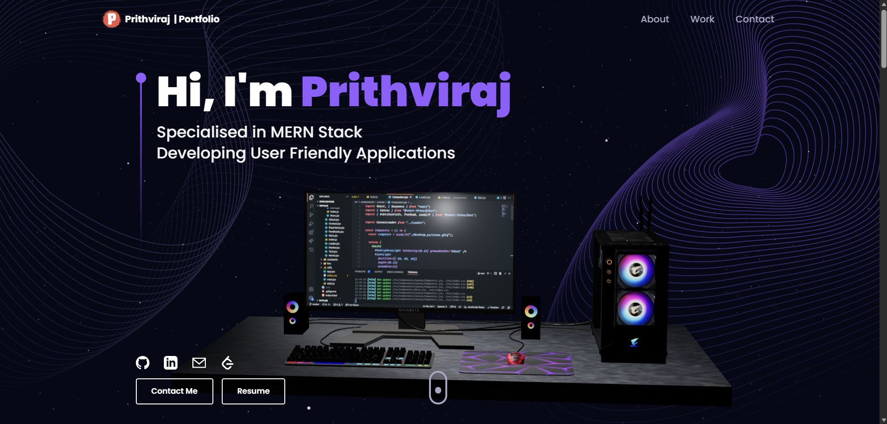

# 🚀 Prithviraj | 3D Portfolio Website



A modern, interactive 3D developer portfolio built with React, Three.js, and Framer Motion — featuring a full gaming PC hero scene, animated skill balls, achievement cards, and a working contact form.

---

## ✨ Features

- 🖥️ **Interactive 3D Hero** — Full gaming PC setup rendered with Three.js
- 🎯 **Animated Sections** — Smooth scroll animations powered by Framer Motion
- 🛠️ **Skills Section** — 3D rotating tech ball icons
- 💼 **Experience Timeline** — Vertical timeline with company details
- 🏆 **Achievements Section** — SSB Interview, Smart India Hackathon, Google Gen AI Study Jam
- 📁 **Projects Showcase** — Project cards with tech tags and GitHub links
- 📬 **Contact Form** — EmailJS powered form with 3D Earth canvas
- 📱 **Fully Responsive** — Works on all screen sizes

---

## 🛠️ Tech Stack

| Frontend | 3D & Animation | Tools |
|---|---|---|
| React.js | Three.js | Vite |
| Tailwind CSS | React Three Fiber | EmailJS |
| JavaScript | Framer Motion | Git |

---

## 📁 Project Structure

```
prithviraj-portfolio/
├── public/
│   ├── desktop_pc/        # 3D PC GLTF model
│   ├── planet/            # 3D Earth GLTF model
│   └── resume.pdf         # Your resume
├── src/
│   ├── assets/            # Images and icons
│   ├── components/        # React components
│   │   ├── canvas/        # Three.js canvas components
│   │   ├── Hero.jsx
│   │   ├── About.jsx
│   │   ├── Tech.jsx
│   │   ├── Experience.jsx
│   │   ├── Works.jsx
│   │   ├── Feedbacks.jsx
│   │   └── Contact.jsx
│   ├── constants/         # All data (projects, skills, experience)
│   └── App.jsx
```

---

## ⚙️ Getting Started

### 1. Clone the repository
```bash
git clone https://github.com/Prithviraj-Dhavan/prithviraj-portfolio.git
cd prithviraj-portfolio
```

### 2. Install dependencies
```bash
npm install --legacy-peer-deps
```

### 3. Set up environment variables

Create a `.env` file in the root folder:
```
VITE_APP_EMAILJS_SERVICE_ID=your_service_id
VITE_APP_EMAILJS_TEMPLATE_ID=your_template_id
VITE_APP_EMAILJS_PUBLIC_KEY=your_public_key
```

> Get these from [EmailJS Dashboard](https://emailjs.com)

### 4. Run the development server
```bash
npm run dev
```

Open [http://localhost:5173](http://localhost:5173) in your browser.

---

## 🚀 Deployment

Deployed on **Vercel**. To deploy your own:

1. Push code to GitHub
2. Import repo on [vercel.com](https://vercel.com)
3. Add the 3 EmailJS environment variables in Vercel → Settings → Environment Variables
4. Click Deploy ✅

---

## 📬 Contact

- 📧 Email: [prithvirajdhavan2021@gmail.com](mailto:prithvirajdhavan2021@gmail.com)
- 💼 LinkedIn: [linkedin.com/in/prithviraj-dhavan](https://linkedin.com/in/)
- 🐙 GitHub: [github.com/Prithviraj-Dhavan](https://github.com/Prithviraj-Dhavan)
- 💻 LeetCode: [leetcode.com/Prithviraj-Dhavan](https://leetcode.com/)

---

